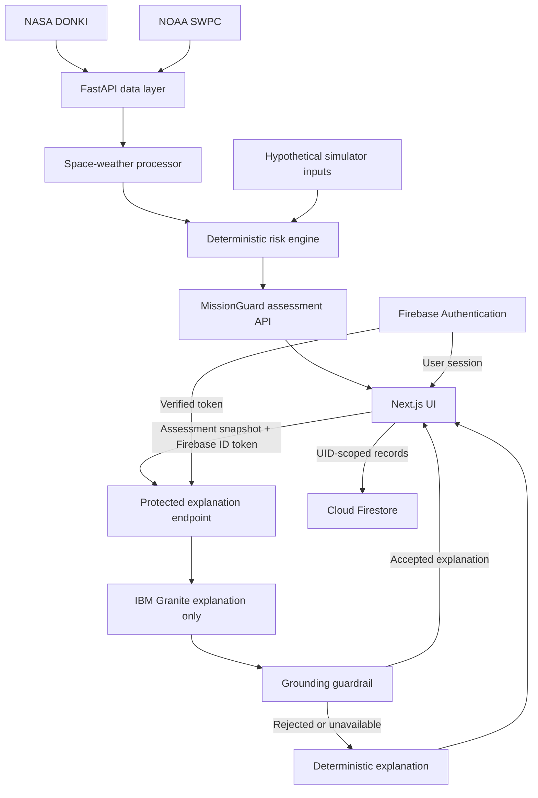

# MissionGuard AI

Space-weather data, transparent risk scoring, and grounded AI explanations in one educational mission-readiness dashboard.

## Live Demo

- [Frontend](https://missionguard-ai-one.vercel.app)
- [Backend API](https://missionguard-ai-b49o.onrender.com)
- [FastAPI documentation](https://missionguard-ai-b49o.onrender.com/docs)

Sign in or create a Firebase account to access the dashboard and personal history.

## Overview

Space-weather information is spread across different feeds and can be difficult to interpret quickly. MissionGuard combines NASA DONKI events and NOAA planetary Kp readings, normalizes them, and applies an explicit scoring model.

The deterministic engine produces the score, readiness percentage, risk level, and recommendation. IBM Granite explains that result; it does not decide it. This is an educational decision-support prototype, not an operational spacecraft or launch-safety system.

## Key Features

- NASA DONKI solar flares, coronal mass ejections (CMEs), and geomagnetic storm events.
- NOAA SWPC planetary Kp readings and a recent-activity chart.
- Deterministic four-factor risk engine with a score out of 100 and readiness percentage.
- Live dashboard with 60-second refresh, provider availability, and incomplete-data handling.
- What-if simulator using the same scoring engine as live assessments.
- IBM watsonx.ai / Granite explanations, grounding guardrails, and deterministic fallback.
- Firebase Email/Password Authentication and user-scoped Firestore mission history.
- Saved live assessments and simulations; simulation records can include Granite or fallback explanations.
- Firebase Bearer-token protection for the AI explanation endpoint.
- Next.js frontend on Vercel and FastAPI backend on Render.

## Screenshots

Screenshots are still to be added. See the [capture checklist](docs/screenshots/README.md) for the dashboard, risk cards, Kp chart, simulator, explanations, history, and login views. No generated or placeholder images are presented as application screenshots.

## System Architecture



There is no path from Granite back into the scoring engine. The browser submits an assessment snapshot to the explanation endpoint; the endpoint does not certify the provenance of client-supplied data. See [architecture and trust boundaries](docs/ARCHITECTURE.md).

## Risk Engine

| Factor | Maximum contribution |
| --- | ---: |
| Geomagnetic activity / Kp | 35 |
| Solar flare | 25 |
| CME activity | 30 |
| Geomagnetic storm events | 10 |
| **Total** | **100** |

Readiness is `100 - risk_score`. It is a model score, not a probability of mission success or a calibrated safety estimate.

| Risk score | Risk level | Prototype recommendation |
| --- | --- | --- |
| 0–24 | LOW | GO |
| 25–49 | MODERATE | CAUTION |
| 50–74 | HIGH | DELAY |
| 75–100 | CRITICAL | NO-GO |

The [engine](backend/services/risk_engine.py) uses fixed bands for Kp and flare strength, adds Earth-directed CME count and speed contributions, and adds storm-count points. The quiet-Kp band contributes 2 points. CME speed is the fastest speed in returned analyses, not only Earth-directed CMEs.

Incomplete required source data produces null scores, `UNKNOWN`, and `HOLD`. The live endpoint can instead return a previously complete assessment for up to 30 minutes, marked `stale-fallback`; fresh cache entries last 5 minutes. This cache is local to each backend process.

These weights and classifications are educational choices, not an official NASA or NOAA scoring model.

## AI Explanation Layer

The deterministic assessment is the source of truth. IBM Granite (`ibm/granite-4-h-small`) receives the assessment and its contributing factors, then produces explanatory text.

The backend checks supported numeric claims, factor assignments, classification, recommendation, dominant-factor claims, simulation wording, and disallowed operational language. Unsupported responses are rejected and replaced with an explanation assembled from the supplied assessment. Missing credentials and provider errors also use the fallback.

Granite cannot change the score, readiness, risk level, or recommendation. The guardrails are conservative pattern checks, not proof that every possible wording is factual. Model-authored NASA/NOAA references are rejected; source attribution and the disclaimer remain in the application and deterministic fallback.

## What-If Simulator

Users can modify Kp, flare class and magnitude, Earth-directed CME count, CME speed, and storm count. The simulator builds a hypothetical weather summary and runs the existing deterministic engine. It does not modify live observations.

Explanations identify simulated or hypothetical conditions and reject wording that presents them as recorded, observed, measured, or detected events. Saved simulations preserve the inputs used to calculate the result, even if the sliders are subsequently edited.

## Authentication and Saved History

Firebase Email/Password Authentication protects the dashboard experience. The frontend sends Firebase ID tokens to the AI endpoint. The backend verifies the RS256 signature, issuer, audience, expiry, required claims, and authentication time using Google's signing certificates.

Firestore records use these paths:

```text
users/{uid}/assessments/{recordId}
users/{uid}/simulations/{recordId}
```

Mission History combines both collections and sorts records by timestamp. Simulations can store their explanation; generate it before saving to include it. Live assessment records currently store the assessment and weather snapshot, not the separately displayed live explanation.

## Security

- NASA and IBM credentials stay in backend environment variables. Actual environment files, private-key files, and common service-account filenames are ignored.
- Firebase browser configuration is public web configuration and appears only in frontend code. It is not an authorization boundary.
- `POST /ai-explanation/explain` requires a Firebase Bearer token; missing or invalid tokens return 401.
- [Firestore rules](firestore.rules) restrict both saved-record collections to the authenticated UID. **Compare and publish these rules to the actual Firebase project manually; production rules were not verified by this repository review.**
- CORS allows only the deployed frontend, localhost port 3000, and 127.0.0.1 port 3000. CORS is a browser policy, not API authentication.
- Public weather, risk, and simulator routes remain public. The UI auth gate does not make those APIs private.
- NASA failure responses omit exception URLs, which may contain query-string credentials.

No service-account private key is required by the current backend. Saved records are user-controlled portfolio history, not tamper-proof operational audit records. The AI endpoint has authentication but no per-user quota; evaluate rate limits before wider public use.

## Technology Stack

| Area | Technologies |
| --- | --- |
| Frontend | Next.js, React, TypeScript, Tailwind CSS, Firebase web SDK |
| Backend | Python, FastAPI, httpx, Pydantic, PyJWT, cryptography |
| AI | IBM watsonx.ai, IBM Granite |
| Data | NASA DONKI, NOAA SWPC |
| Deployment | Vercel, Render, Firebase Authentication / Firestore |
| Offline experiments | pandas, NumPy, scikit-learn, joblib |

## Project Structure

```text
missionguard-ai/
├── backend/
│   ├── main.py                 # FastAPI entry point and CORS
│   ├── requirements.txt
│   ├── .env.example
│   ├── pytest.ini
│   ├── routes/                 # Weather, risk, simulator, explanation APIs
│   ├── services/               # Providers, normalization, scoring, auth, AI
│   ├── tests/                  # Deterministic and regression tests
│   ├── scripts/                # Provider diagnostics and offline ML experiments
│   └── data/                   # Historical and experimental datasets
├── frontend/
│   ├── app/                    # Dashboard, auth, history, shared layout
│   ├── components/             # Simulator, explanation, save and auth UI
│   ├── lib/                    # Firebase setup and authenticated fetch
│   ├── public/
│   ├── .env.example
│   └── package.json
├── docs/
│   ├── ARCHITECTURE.md
│   └── screenshots/README.md
├── firestore.rules
└── README.md
```

## Local Development

Use Python 3.12 (the repository pins 3.12.10), Node.js 20.9 or newer, npm, and a Firebase project with Email/Password Authentication and Firestore enabled. Use matching Firebase project IDs in both applications.

From the repository root, in PowerShell:

```powershell
cd backend
python -m venv .venv
.\.venv\Scripts\Activate.ps1
python -m pip install -r requirements.txt
# Only if .env does not already exist:
Copy-Item .env.example .env
python -m uvicorn main:app --reload
```

Fill in the backend environment file before starting uvicorn. On macOS/Linux, activate with `source .venv/bin/activate` and copy with `cp -n .env.example .env`. If PowerShell blocks activation, use `.\.venv\Scripts\python.exe` directly for pip and uvicorn.

In a second terminal, from the repository root:

```powershell
cd frontend
npm ci
# Only if .env.local does not already exist:
Copy-Item .env.example .env.local
npm run dev
```

Fill in frontend configuration before starting Next.js. Open [localhost:3000](http://localhost:3000); backend docs are at [localhost:8000/docs](http://localhost:8000/docs). Keep the frontend on port 3000 to match development CORS. Add the local and deployed frontend domains to Firebase Authentication's authorized domains, and publish appropriate Firestore rules.

Environment variable names used by the runtime:

| Backend | Purpose |
| --- | --- |
| `NASA_API_KEY` | Required NASA provider configuration |
| `WATSONX_API_KEY` | IBM API credential; omit with other watsonx settings for fallback-only mode |
| `WATSONX_PROJECT_ID` | IBM project containing model access |
| `WATSONX_URL` | watsonx service URL for the intended Frankfurt region |
| `FIREBASE_PROJECT_ID` | Firebase token audience and issuer project |

Frontend: `NEXT_PUBLIC_API_URL`, `NEXT_PUBLIC_FIREBASE_API_KEY`, `NEXT_PUBLIC_FIREBASE_AUTH_DOMAIN`, `NEXT_PUBLIC_FIREBASE_PROJECT_ID`, `NEXT_PUBLIC_FIREBASE_STORAGE_BUCKET`, `NEXT_PUBLIC_FIREBASE_MESSAGING_SENDER_ID`, `NEXT_PUBLIC_FIREBASE_APP_ID`.

Only variable names are documented here; [backend](backend/.env.example) and [frontend](frontend/.env.example) examples contain safe placeholders. Never put NASA or IBM credentials in `NEXT_PUBLIC_*` variables. Do not overwrite existing environment files when following setup commands.

## API Endpoints

| Method | Path | Authentication | Purpose |
| --- | --- | --- | --- |
| GET | `/` | Public | API status message |
| GET | `/health` | Public | Process health, not provider connectivity |
| GET | `/space-weather/solar-flares` | Public | DONKI flare events |
| GET | `/space-weather/cmes` | Public | DONKI CME events |
| GET | `/space-weather/geomagnetic-storms` | Public | DONKI storm events |
| GET | `/space-weather/kp-index` | Public | Latest normalized Kp and history |
| GET | `/space-weather/current` | Public | Combined provider responses |
| GET | `/space-weather/summary` | Public | Normalized weather summary |
| GET | `/mission-risk` | Public | Deterministic live assessment |
| POST | `/simulator/evaluate` | Public | Hypothetical assessment |
| POST | `/ai-explanation/explain` | Firebase Bearer token | Grounded explanation or fallback |

NASA-backed GET routes and `/mission-risk` accept `days` from 1 through 30, defaulting to 7. Request schemas and simulator limits are available in FastAPI's generated docs. Explanation requests contain `mode`, `mission`, `risk_factors`, and `space_weather`.

## Testing

```powershell
cd backend
.\.venv\Scripts\python.exe -m pytest
cd ../frontend
npm run lint
npx tsc --noEmit
npm run build
```

The backend suite includes:

- `test_risk_engine.py`: low, moderate, high, critical, and incomplete-data behavior.
- `test_providers.py`: NOAA numeric normalization and invalid readings; NASA error redaction and malformed responses.
- `test_ai_grounding.py`: swapped factors, incorrect scores/readiness/classifications, operational and authority claims, simulation wording, and deterministic fallback.
- `test_api.py`: public routes with mocked feeds, input bounds, simulator results, missing/invalid authentication, fallback through an overridden authenticated dependency, and CORS.

Tests use mocked external providers and do not call paid AI services. They do not certify production Firebase rules or exercise a real user's token. `pytest.ini` keeps manual IBM diagnostic scripts out of automated collection.

For a release, also check sign-in, live refresh, simulator, explanations, saving both record types, history reload, and sign-out with an authorized test account. Verify that a second UID cannot read or write the first UID's records.

## Deployment

- **Vercel:** use `frontend` as the project root with the Next.js preset. Configure frontend variables before building; public variables are embedded at build time.
- **Render:** use `backend` as the service root, install with `pip install -r requirements.txt`, and start with `uvicorn main:app --host 0.0.0.0 --port $PORT`. Use `/health` as the process health check.
- **Firebase:** enable Email/Password sign-in, configure authorized domains, and manually compare/publish [firestore.rules](firestore.rules). No automatic Firebase deployment configuration is included.
- **watsonx.ai:** use the intended Frankfurt project/service region and confirm access to the configured Granite model. Credentials stay in the backend environment.

The CORS allowlist contains the existing Vercel hostname and two local origins. A different frontend hostname needs an intentional backend allowlist update. No hosting configuration or production variables are changed by this cleanup.

## Limitations

- The educational model has not been validated for spacecraft, crew, launch-site, or vehicle-specific decisions.
- External APIs may be slow, unavailable, or return delayed observations. NASA retries can make requests slow during outages.
- Cached assessments may be up to 30 minutes old; inspect API cache metadata when freshness matters.
- If the backend uses Render's free tier, cold starts may delay initial requests.
- Granite output may be rejected. Pattern checks cannot guarantee detection of every unsupported claim.
- Historical ML storm forecasting was evaluated but was not promoted into the production decision engine because it did not meet the quality gate. Retained `scripts/` and `data/` files are experiments, not deployed forecasting. The finalization script gates model export on validation metrics.
- Mission history is browser-written, user-scoped storage. Production rules and authenticated end-to-end behavior need release verification.
- This is not official mission-planning guidance.

## Future Improvements

Historical validation, additional NOAA feeds, time-series forecasting after proper validation, organization/team accounts, exportable reports, alert subscriptions, per-user AI quotas, and improved observability are possible next steps. They are not implemented features.

## Disclaimer

MissionGuard AI is an educational and portfolio prototype. It is not affiliated with NASA, NOAA, IBM, or any launch provider. It must not be used as the sole basis for operational, spacecraft, mission, or launch-safety decisions.

## Author

[Faith-loves](https://github.com/Faith-loves)
